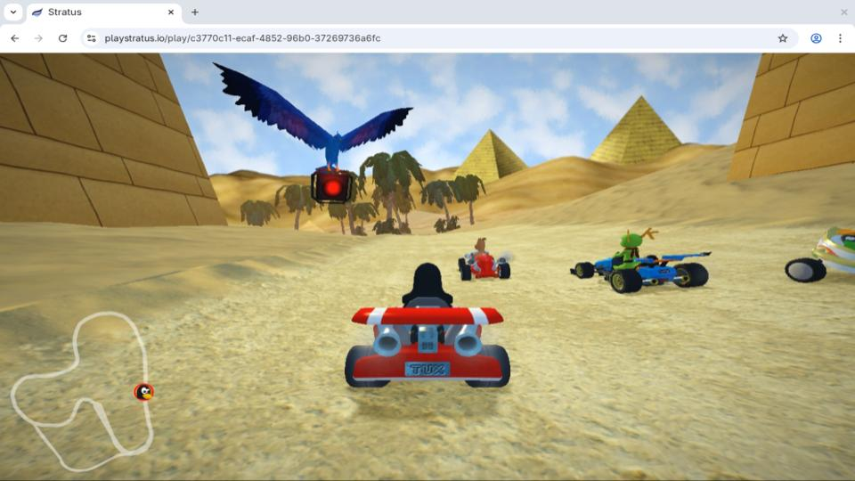

<p align="center">
<a href="https://www.playstratus.io">

</a>
</p>
<h3 align="center">A Web-Based Game Streaming Service</h3>
<br/>
<p align="center">
<a href="https://www.playstratus.io">

</a>
</p>

Stratus is a game streaming service that enables users to play games directly
from their web browser. It starts stream sessions in under 2 seconds and
achieves input-to-frame latencies of as little as 60ms while streaming 1080p
game video at 60fps. Stratus is unique among cloud gaming solutions for its use
of Linux-based streaming servers, the WebTransport protocol for streaming to web
browsers, and a custom Wayland proxy for capturing game video.

For more information, visit [playstratus.io](https://www.playstratus.io).


## Project Structure

Stratus is composed of three main components: a cluster of streaming servers
that run games, a web client that streams games from the streaming servers, and
a coordination server that pairs clients with streaming servers. The source code
for all three is located in this monorepo, which is organized as follows:

- `backend/`: the coordination server
- `design/`: design files for the frontend UI
- `docs/`: content for the [Stratus blog](https://www.playstratus.io/#Blogs)
- `frontend/`: the Stratus website and streaming client
- `games/`: scripts for packaging games to run on Stratus
- `os/`: scripts and packages for provisioning new streaming servers
- `stratusd/`: the streaming server daemon

Each subdirectory contains a `REAMDE.md` with instructions on building the
component locally for development. Refer to the [Stratus
blog](https://www.playstratus.io/blogs/architecture) for more details on the
architecture of Stratus.


## Deployment

1.  **Google OAuth:** Register a Google OAuth client and obtain the access
    credentials (client ID and secret).

2.  **AWS:** Create an AWS account and obtain the access credentials (region,
    key ID, and access key).

3.  **DynamoDB:** Configure and populate a DynamoDB instance consisting of the
    following tables and columns:

    - **Games**: `GameID` (string), `developer` (string), `genres` (list of
      strings), `lDescript` (string), `s3` (list of strings), `sDescript`
      (string), `title` (string)
    - **Users**: `UserID` (string), `Username` (string), `Email` (string)

4.  **Web Client:** The frontend is a Next.js web app packaged as a Docker
    image. Deploy it by running

    ```
    $ cd frontend
    $ cp .env.example .env
    $ vim .env # set environment variables
    $ docker build -t stratus-frontend .
    $ sudo docker run -p 80:3000 --env-file=.env stratus-frontend
    ```

5.  **Coordination Server:** The coordination server is also packaged as a
    Docker image. Deploy it by running

    ```
    $ cd backend
    $ cp .env.example .env
    $ vim .env # set environment variables
    $ docker build -t stratus-backend .
    $ sudo docker run -p 80:4000 --env-file=.env stratus-backend
    ```

    You will most likely also want to configure both containers to run
    automatically and use a reverse proxy to serve them over HTTPS.

6.  **Streaming Servers:** The streaming servers are deployed on bare metal. For
    each one, boot into a live Arch Linux environment and run the Stratus OS
    installer:

    ```
    # curl -sL os.playstratus.io/install.sh | bash
    ```

    After rebooting you will be able to log into the `stratusd` user account
    over the console or an SSH connection to perform system administration
    tasks. The core streaming service runs under the `stratusd` systemd service.

7.  **Start Streaming:** The streaming servers should appear on the frontend's
    `/heart` dashboard within 15 minutes. Once they do, you can log in and start
    a stream session.


## Project Authors

Stratus was developed by a team of Oregon State University students as a
capstone project.

<!--
## Project Status

Stratus was developed by a team of Oregon State University students as a
capstone project. It was released in May 2026, and is no longer actively
developed or hosted publicly.
-->
