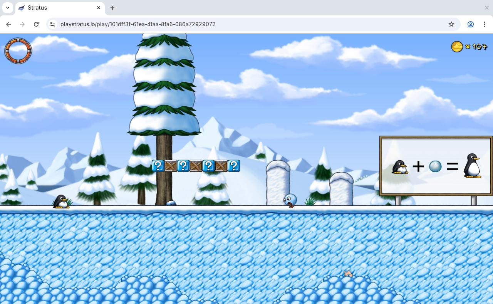

<h3 align="center">Low-latency Game Streaming Service</h3>
 

Stratus is a low-latency game streaming service that enables users to play games
directly from their web browser. It supports streaming game video, audio, and
controller input with an end-to-end latency of as little as 50ms. For more
information, visit [playstratus.io](https://www.playstratus.io).

## Project Structure

Stratus is composed of three main components: a cluster of stream servers that
run games, a web client that streams games from the stream servers, and a
coordination server that pairs clients with stream servers. The source code for
all three is located in this monorepo, which is organized as follows:

- `backend/`: the coordination server
- `design/`: design files for the frontend UI
- `docs/`: content for the [Stratus blog](https://www.playstratus.io/#Blogs)
- `frontend/`: the Stratus website and streaming client
- `games/`: scripts for packaging games to run on Stratus
- `os/`: scripts and packages for provisioning new stream servers
- `stratusd/`: the stream server daemon

Refer to the `README.md` files in each subdirectory for instructions on building
each component, and to the [Stratus blog](https://www.playstratus.io/#Blogs) for
more details on the architecture of Stratus.

## Project Status

Stratus was developed by a team of students at Oregon State University as a
capstone project.

<!-- It was released in June 2026, and is no longer actively developed or hosted
publicly. -->
