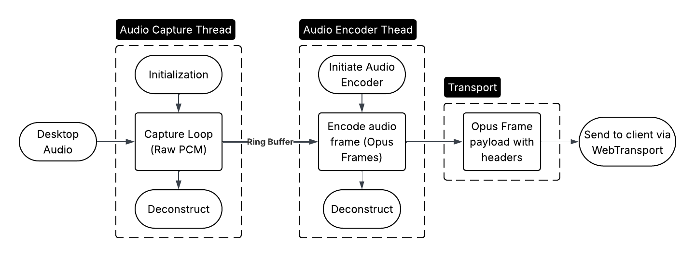

# Audio Capture Pipeline

## Implementation

In the sidecar process, there are two threads: the audio capture thread and the audio encoder thread. The audio capture thread captures audio frames from the desktop and produces them to a ring buffer. The audio encoder thread consumes audio frames from the ring buffer, encodes them, and send them to transport via a common mailbox, where it will be sent to the client.

### Audio Capture Thread

> Used [Pipewire Audio Capture Example](https://docs.pipewire.org/audio-capture_8c-example.html) as a reference to capture audio from the desktop.

#### Initialization

- Gets the format (sample_rate and channels) of the desktop audio stream
- Starts the audio capture loop

#### Capture Loop

- Captures audio frames from the desktop
- Converts the captured audio frames to the format required by the encoder
- Produces the captured audio frames to a ring buffer for the encoder thread to consume

#### Deconstruct

- Stops the audio capture loop
- Cleans up resources used for audio capture

### Audio Encoder Thread

> Copied layout of Encoder.

#### Initiate Audio Encoder

- Initializes the audio encoder with the format (sample_rate and channels) obtained from the audio capture thread
- Starts the audio encoding loop to consume audio frames from the ring buffer

#### Encode audio frames

- Consumes audio frames from the ring buffer produced by the audio capture thread
- Encodes the consumed audio frames using the initialized audio encoder
- Sends the encoded audio frames and frame size to transport via a common mailbox for the client to consume (not implemented yet)

#### Deconstruct

- Stops the audio encoding loop
- Cleans up resources used for audio encoding

### Transport

> Not implemented yet, waiting for new common mailbox.

## Future Work

- Implement transport of encoded audio frames to the client
- Handle audio on the client side (decoding and playback)
