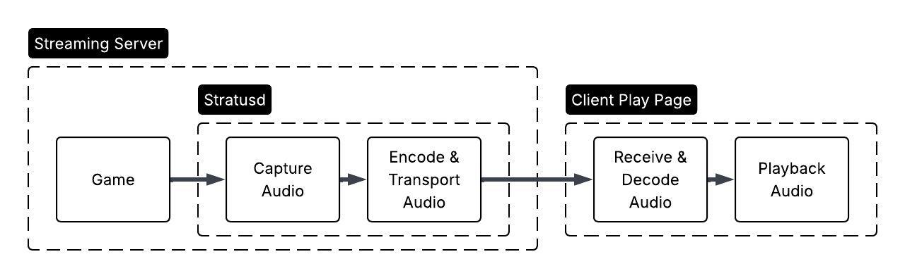
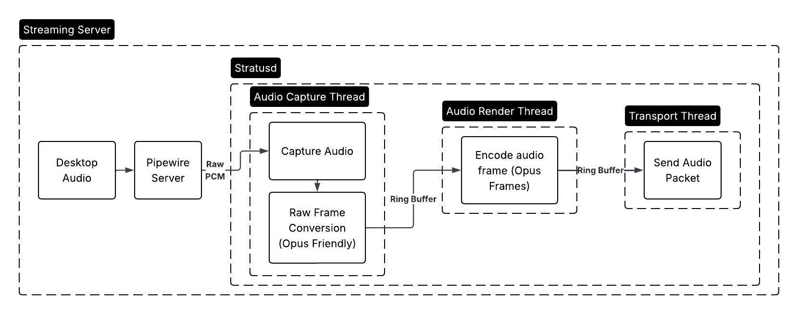
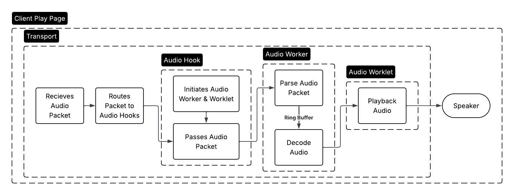

# Audio Pipeline

## Overview

The audio pipeline is how Stratus carries game sound from the streaming server to the player's browser. Its goal is simple: keep the audio clear, continuous, and closely matched to what the player sees on screen.

At a high level, Stratus does four things:

1. Captures the sound produced by the running game.
2. Compresses that sound so it can travel quickly over the network.
3. Sends it to the browser over the same low-latency connection used by the
   rest of the stream.
4. Decodes and plays it through the user's speakers or headphones.

Audio is handled separately from video. That separation is important because sound needs to keep moving even when a video frame takes longer than expected. If the video stream briefly slows down, the audio pipeline can continue playing without waiting on it.

## Server Side

On the streaming server, the game produces audio the same way a local game
would: it sends sound to the operating system. Stratus listens to that game
audio through PipeWire, the Linux audio system used by the streaming node.

Once Stratus has the audio, it prepares it for streaming. Raw audio is too large
to send efficiently in real time, so Stratus compresses it with Opus, a codec
designed for interactive audio such as voice chat, game streaming, and live
media. Opus keeps the packets small while preserving enough quality for gameplay
to feel natural.

After compression, the server hands the audio packets to the transport layer.
From this point forward, the audio is ready to travel to the player.

## Network Transport

Stratus sends audio to the browser using WebTransport. WebTransport lets the
browser and streaming server exchange low-latency data over the network, which
makes it a good fit for interactive game streaming.

Audio uses its own stream within the WebTransport connection. This gives Stratus
room to treat audio as its own live signal instead of bundling it together with
video frames or controller input. Each part of the experience can move through
the system independently while still sharing one connection between the player
and the streaming server.

## Browser Playback

In the browser, Stratus receives the audio stream and routes it to the playback
system. The browser decodes the compressed Opus audio back into playable sound,
then feeds it into the Web Audio API.

The Web Audio API is responsible for the final handoff to the user's audio
device. Stratus keeps a small amount of decoded audio ready so playback can stay
smooth, but it avoids building up a large delay. For live streaming, being
slightly less buffered is better than playing old sound late.

## Why It Matters

Good streaming audio should feel invisible. Players should hear jumps, shots,
music, menu sounds, and environmental cues as if the game were running locally.
The Stratus audio pipeline supports that by focusing on three priorities:

- Low delay, so sound stays close to the action on screen.
- Smooth playback, so brief network or processing hiccups are less noticeable.
- Independent delivery, so audio does not get stuck behind video work.

Together, these pieces let Stratus deliver game audio as a live part of the
stream rather than as an afterthought attached to video.
