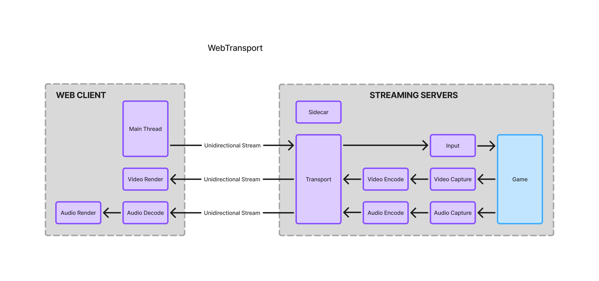

**WebTransport**

WebTransport is a novel API that enables connection to a HTTP/3 server. Most other game streaming services use WebRTC, an older API used to send their data over the internet. We decided to tackle WebTransport to determine how much improvement we could have over the major game streaming platforms. 

WebTransport has many methods of communication such as datagrams, bidirectional, and unidirectional streams. With datagrams it allows you to send them at a very high speed, but it is an unreliable sending method. We attempted to implement datagrams, and were able to successfully get a test version working. While the test datagram version worked, it would have required significantly more handling than we had time to implement for a production ready service. This ultimately meant given our time limitations we determined it would be better to use WebTransport’s built in streams. If we had more time, we could have used datagrams and gained a significant speed increase. If development continues on this project I would recommend looking into this possibility. 

In regards to WebTransport’s streams they allow us to use either a bidirectional or unidirectional stream. This means we could send data one way or have a channel that is able to send messages both ways. We decided to only use unidirectional streams to ensure a fast and consistent data sending

In our time working with WebTransport it only recently gained more compatibility across browsers (March 2026). This shows that the API is actively being worked on and will continue to improve. It initially only worked on chrome, but now works across many modern browsers. We expect that WebTransport will continue to be improved and we will start to see it implemented in many applications across the internet.

**Figure 1**: This figure shows how WebTransport communicates between our web client and our streaming server. Note all communication directly between the web client and streaming service is unidirectional to keep that specific channel clear of unneeded data.

