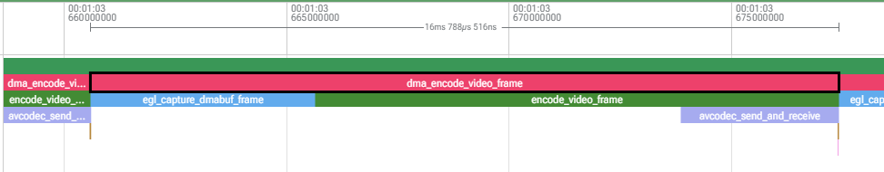
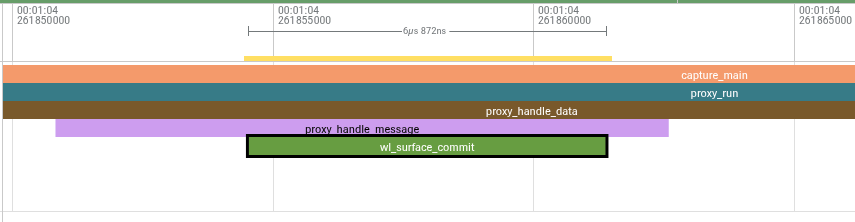

It only takes a second for a player to complain that a game stream is lagging. Yet quantifying this lag is more nuanced than you might think. For the purpose of this post, we will identify 3 types of latency. Time to First Image is the time it takes between pressing play and the game appearing on your screen. Glass to Glass Latency is the time it takes for a video frame on the server to reach the client. And lastly, Click to Photon latency is the time it takes for the stream to react to player input. 

### Time to First Image

| Stratus     | Geforce Now  |
| ----------- | ------------ |
|  |  |

| Amazon Luna  | Xbox Cloud Gaming |
| ----------- | ------------ |
|  | |

The start of every stream begins with a push of a button, at which point the streaming service must match your request to stream with a compatible node and begin the stream, which may involve a VM being provisioned or a prewarmed instance being allocated to you. Since no one benefits from long loading screens, the faster this can occur, the better the user experience. This is an area in which Stratus excels. Other game streaming services spin up an entire Windows VM for each user. Stratus instead utilizes Linux namespaces and cgroups to quickly create an immutable environment for each game session to run within, allowing for sessions to start in 2 seconds. 

Certain game streaming services like GeForce Now use a technique called [prewarming](https://github.com/NVIDIAGameWorks/GeForceNOW-SDK/blob/master/samples/README.md) to reduce time-to-first-image. This allows a server node to launch and initialize a game before the user even requests a session. Stratus is able to maintain fast launch times without the use of prewarming.

### Glass to Glass Latency

The most straightforward method we found for recording glass to glass latency has been to place the server and client displays side by side, recording them at 240 FPS and manually counting the number of frames between an image appearing on the server display and the client display. Typically Stratus nodes are headless and do not output any video on the server node. In order to facilitate latency testing we configured stratus to 

In our testing, Stratus 1080P 60 FPS streams have an average Glass to Glass latency as low as 20 ms without the use of hardware video encoding. 

### Encode Time
Due to our choice of server hardware (BC-250s), we are unable to use hardware video encoding thefore aproximetely 16 ms of the time spent processing each frame is spent on software encoding.

### Capture Time
Due to our novel frame capture method of intercepting Wayland messages from the game before they reach the compositor, our time spent capturing frames is quite negligible, with typically less than 7 microseconds spent capturing each frame. This method of frame capture also allows us to enforce display requirements on the game process, such as enforcing an arbitrary resolution or refresh rate.

### Click to Photon Latency
Click-to-photon latency is the most representative latency metric for a game streaming service, as it does not matter how smooth the video stream appears if it takes forever to respond to your inputs. In our testing, Stratus has a click-to-photon latency as little as 40 ms under ideal conditions.