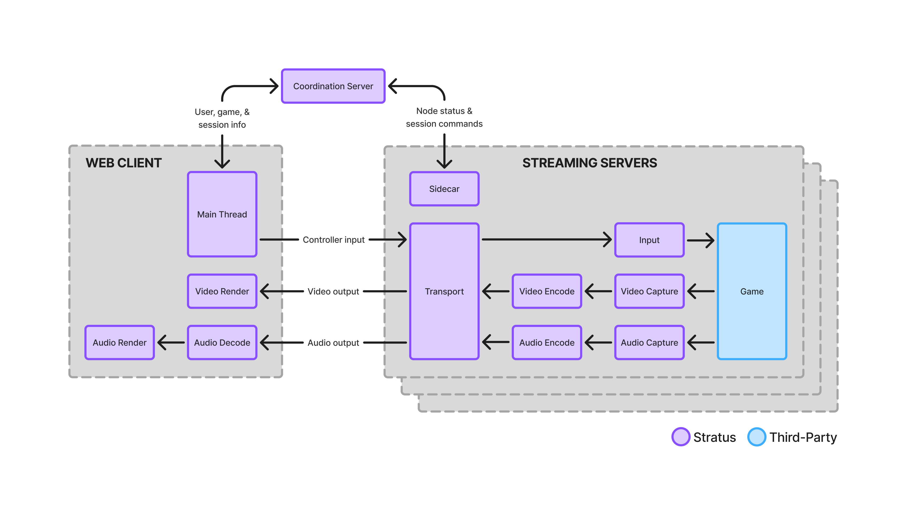
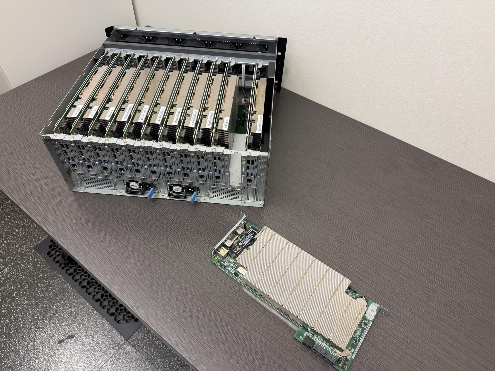
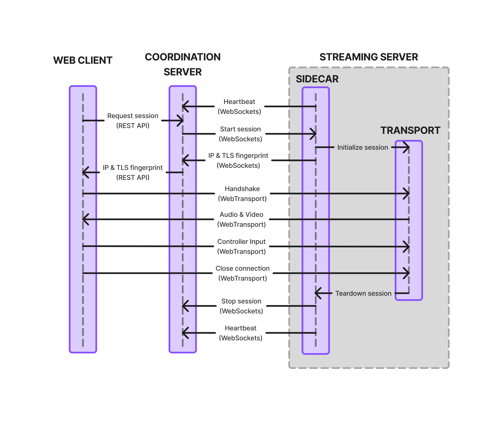
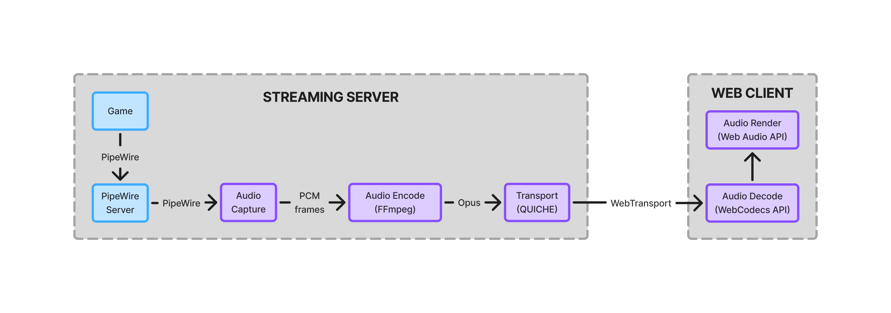
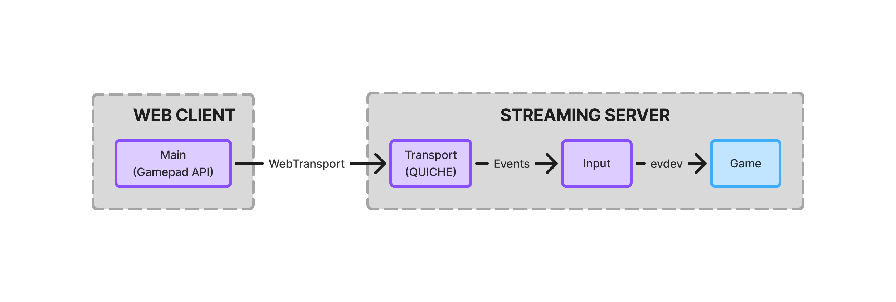

This post documents the architecture of Stratus, an open-source game streaming
service created by a team of Oregon State University students for their senior
capstone project. Stratus is unique among cloud gaming solutions for its use of
Linux-based streaming servers, the WebTransport protocol for streaming to web
browsers, and a custom Wayland proxy for capturing game video. This architecture
has enabled it to keep startup times under 2 seconds and achieve input-to-frame
latencies of as little as 60ms while streaming 60fps game video at 1080p (see
our [analysis of Stratus' performance][blogs-performance] for more details).

## Overview

Stratus is composed of three core components: a frontend web client, a cluster
of streaming servers, and a coordination server. The client enables users to
browse the Stratus game library, select a game to play, and then connect to a
game session on a streaming server. The streaming servers run the games, stream
game content to the clients, and inject client input into the games. Finally,
the coordination server pairs clients with streaming servers, and also provides
clients with APIs for authentication and game library queries.

The streaming server is further subdivided into seven modules (shown below). The
Sidecar module is the first to start, and is responsible for taking commands
from the coordination server, initializing/terminating the other modules when a
stream session is started/stopped, and launching the game. (Each streaming node
currently only supports one simultaneous stream session for simplicity).
Communication with the web client is handled by the Transport module. The
remaining streaming server modules handle the processing of game video, audio,
and controller input. Similarly, the web client also uses separate threads for
rendering game audio and video.

## Tech Stack & Hosting

The web client is a Next.js app built with TypeScript and Tailwind CSS. It
depends on Google OAuth for authentication and an S3 bucket for game asset
storage. The coordination server is also written in TypeScript, and uses
express.js to provide a REST API for the frontend clients and a WebSockets APIs
for the streaming servers. User and game records are persisted in a DynamoDB
instance. Lastly, the streaming server is a multithreaded C / C++ app built with
CMake that utilizes Google's QUICHE library for communicating with frontend
clients over WebTransport.

While the frontend and coordination server are both deployed in the cloud (on
Vercel and an AWS EC2 instance, respectively), the streaming servers run on a
cluster of 12 BC-250 nodes (pictured below) that are hosted on-prem. The cluster
was originally created for mining cryptocurrency, but it is an excellent fit for
game streaming as well. Each node contains a PlayStation 5 APU with 6 Zen 2 CPU
cores, an RDNA 2 GPU with 25 Compute Units, and 16 GB of GDDR6 memory. A custom
Arch Linux installation script (described in detail in our ["Stratus
OS"][blogs-os] post) is used to provision the nodes with all necessary Stratus
software, games, and dependencies.

## Stream Session Lifecycle

As previously mentioned, the coordination server is responsible for managing
stream sessions by pairing clients with streaming servers. It monitors the state
of the streaming cluster by listening for the heartbeat messages sent
periodically by each streaming node, which contain the current system load,
software version, and installed games. When a user requests to start a stream
session, the coordination server chooses an available streaming node that has
the game installed and sends it a command to start the session.

When this command is received by the Sidecar on the streaming server, it starts
new instances of the other modules in new threads and then launches the game in
a separate process. Since the streaming server runs on Linux, Wine is used to
run games that are native to Windows. Additionally, each game is packaged as a
single AppImage file and utilizes Linux's Overlay Filesystem to run in a
non-persistent sandbox. Our post on [game packaging][blogs-games] further
explains how games are packaged and executed.

Once the modules and game have been successfully started, the Sidecar responds
to the coordination server with its IP address and a TLS fingerprint that is
tied to the session. These credentials are then forwarded to the client, who
establishes a direct WebTransport connection to the streaming server and begins
streaming game I/O. When the user closes the stream, the streaming server sends
a message to the coordination server to stop the session, and the coordination
server marks the node as available again.

## Streaming Pipelines

Stratus implements three separate pipelines to provide full game streaming
functionality: video output, audio output, and controller input. Data for all
three pipelines is transported directly between the client and streaming server
using WebTransport, a new protocol built on top of HTTP/3 that includes support
for multiple concurrent bidirectional streams. Stratus uses Google's QUICHE
library to implement the server side of this connection, and on the client side,
support for WebTransport is included in all modern web browsers. Read our
[Transport post][blogs-transport] for more information about our use of
WebTransport and QUICHE.

The video pipeline begins as frames are captured from the game on the streaming
node by the Video Capture module. Since Stratus games run on Linux, they send
frame data to the system's display server using the Wayland protocol. These
frames are intercepted by the Video Capture module using a custom Wayland proxy
in order to minimize video capture latency (see our [Video Capture
post][blogs-capture] for a deep dive on this system). The captured frames
typically take the form of metadata for a direct memory access buffer, so after
they are passed to the Video Encode module, they are read into a standard pixel
buffer using OpenGL before being encoded into H.264 using FFmpeg. Finally, the
encoded frames are passed to the Transport module to be sent to the client,
where they are rendered to the user's screen using the WebCodecs API. We analyze
our video pipeline in more detail in our [Video Streaming post][blogs-video].

The audio pipeline works very similarly. The Audio Capture module pulls game
audio from the system PipeWire server, and the Audio Encode module encodes the
audio into the opus codec using FFmpeg. The encoded audio frames are then sent
to the client by the Transport module in a separate stream within the same
WebTransport connection. Finally, the frontend decodes the audio frames using
the WebCodecs API and plays the audio in the user's browser using the Web Audio
API. Our [Audio Streaming post][blogs-audio] discusses the lower-level
implementation details of this pipeline.

The final streaming pipeline is for controller input. It's worth noting that
Stratus only supports controller input and not keyboard/mouse input. Although
both could be implemented using a similar architecture, we prioritized
controller support because we determined that it would be simpler and quicker to
implement. Controller input events are captured on the client using the Gamepad
API and then sent to the streaming server over a dedicated WebTransport stream.
The Transport module passes each event to the Input module, which injects them
into the game via a virtual gamepad device that is created and operated using
the kernel's evdev interface.

## Conclusion

Stratus' architecture has proven to be efficient yet reliable. There are many
improvements that could be made if we had more time (some of which are described
in our [future work][blogs-future] blog post), but we are proud to have created
such a performant game streaming service in the short nine months of our senior
capstone. If you're interested in learning more about Stratus, we encourage you
to read our other [blog posts][blogs], which go into more detail on different
aspects of Stratus, and to check out the Stratus source code on
[GitHub][github].

[blogs]:                /#Blogs
[blogs-audio]:          ./blogs/Audio_Capture_Pipeline.md
[blogs-capture]:        ./wayland-proxy.md
[blogs-future]:         /blogs/todo
[blogs-games]:          /blogs/todo
[blogs-os]:             /blogs/todo
[blogs-performance]:    ./blog-stratus-performance.md
[blogs-transport]:      ./Blog-Post-Webtransport.md
[blogs-video]:          /blogs/todo
[github]:               https://github.com/PlayStratus/Stratus
