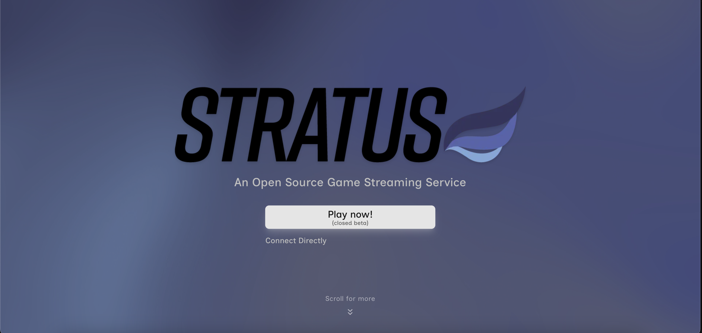
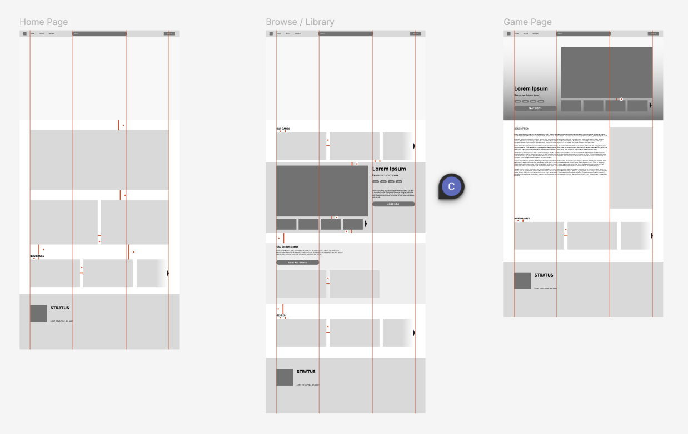
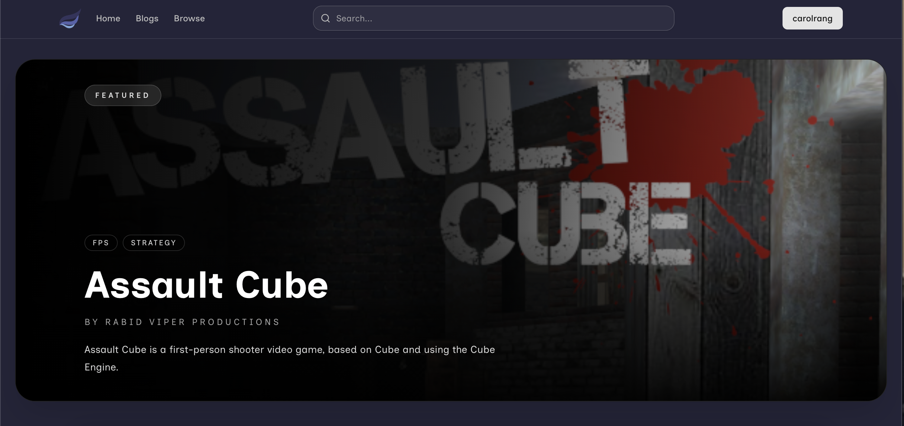

# Frontend UI/UX Design

The frontend design of Stratus was an important consideration throughout development because the website itself serves as the primary point of interaction between the user and the platform. Since video games are inherently user-centered experiences, we wanted the interface to feel intuitive, responsive, and streamlined from the moment a user opens the site. Rather than overwhelming users with excessive menus or text-heavy layouts, the goal was to create an experience that felt visually engaging and easy to navigate.

## Research

Before implementation began, we researched both past and current cloud gaming platforms, along with similar gaming platforms such as Steam. During this process, several consistent design patterns became clear. Most cloud gaming services favored dark mode interfaces with minimalistic layouts, using accent colors to reinforce branding. For example, Xbox Cloud Gaming and Nvidia GeForce NOW prominently feature green highlights, while Google Stadia utilizes orange tones and Steam combines darker blues and greens throughout its interface. These sites also heavily relied on large splash banners, carousels, and game cards to showcase featured titles, updates, and recommendations. While these features were effective at displaying content quickly, many platforms suffered from pages that felt repetitive and visually overwhelming due to endless rows of nearly identical cards and sections.

## Design & Iteration

To avoid these issues, Stratus was first prototyped in Figma using simple wireframes before any frontend implementation began. Over time, the design went through multiple iterations as we refined both the visual layout and the user experience. 

When designing the homepage, we wanted to preserve the strengths of existing cloud gaming platforms while improving readability and navigation. Text was intentionally kept minimal (though, longer and more technical explanations could still be found in our blog posts), with a greater emphasis placed on images, recognizable icons, and quickly digestible information. Additionally, each section of the homepage was designed with distinct visual differences in spacing, layout, and presentation to break up monotony and make browsing feel more natural. 

## User Experience

User experience was another major focus during frontend development. Many existing cloud gaming platforms require users to move through several steps before they are actually able to play a game. For example, Nvidia GeForce NOW often requires users to log in, connect external accounts like Steam, locate a supported game, and then wait through additional loading processes before gameplay begins. Stratus was designed to reduce this friction as much as possible. By implementing Google OAuth authentication, users can log in quickly and begin playing with only a few interactions. In most cases, launching a game takes just two button clicks, creating a faster and more seamless experience that aligns with the convenience cloud gaming platforms are meant to provide. 