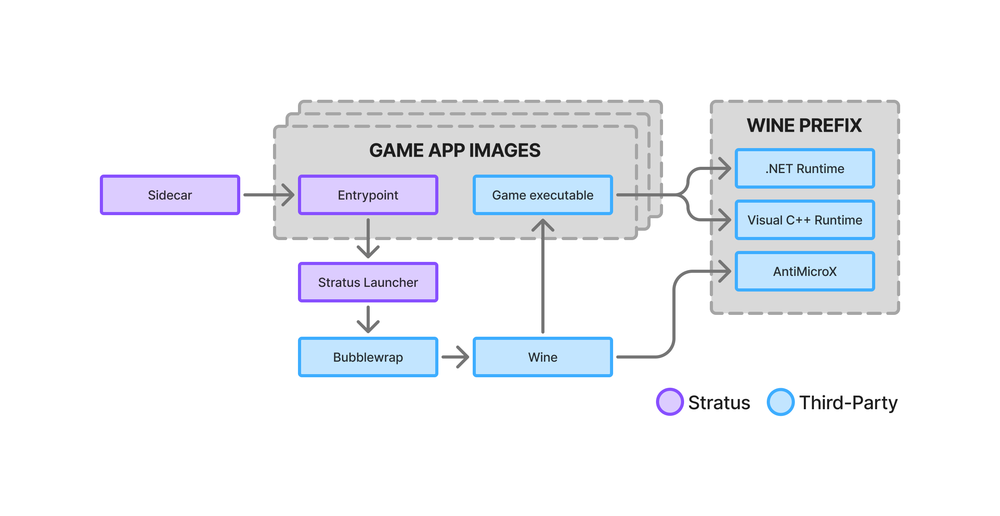

Each Stratus game is individually packaged in order to eliminate extra
dependencies, ensure full compatibility with Stratus, and prevent persistent
changes from being made on the streaming servers. The following diagram summaries
the key components involved in this packaging system, each of which are
described in detail below.

## Dependencies

Stratus uses AppImages to package each game into a single file that can be
easily downloaded or removed from streaming servers as needed. At its core, an
AppImage is just an archive of a filesystem containing all of the files needed
to run an app. When an AppImage is run, Linux mounts this filesystem in a
temporary read-only directory and executes an `AppRun` entrypoint script.
AppImages are easily created using the `appimagetool` tool, and Stratus uses
[per-game shell scripts][stratus-games] to automate the process of collecting
game assets, configuration files, and scripts and bundling them into AppImages.

[stratus-games]:   https://github.com/PlayStratus/Stratus/tree/main/games

Since programs running from inside an AppImage still have full access to the
rest of the host system, Stratus takes a hybrid approach to dependency
management. Game-specific dependencies are included inside of the game's
AppImage, but dependencies that are shared across many games are installed
directly to the streaming server to reduce AppImage file sizes. In particular,
all Stratus AppImage depend on a shared script called the Stratus Launcher that
performs common actions required by many games. For Windows-native games, which
are run through Wine, the Stratus Launcher also ensures that standard
dependencies such as .NET and Visual C++ runtimes are installed into the Wine
prefix located at `~/.wine`.

## Compatibility

Some games support Stratus better than others by default, but most compatibility
issues can be addressed during packaging. The AppImage entry script is commonly
used to pass additional arguments to games to ensure that they open in
fullscreen mode, default to using controller input, and obey the user's
requested screen dimensions. Additionally, there are a few Stratus games, such
as AssaultCube, that do not come with controller support. For these games, a
program called [AntiMicroX][amx] is used to map controller input to keyboard and
mouse input. AntiMicroX is installed inside `~/.wine` by the Stratus Launcher
when the game environment is initialized. To enable it, games simply pass an
argument to the Stratus Launcher with the desired mappings and it will ensure
that AntiMicroX is started.

[amx]: https://github.com/AntiMicroX/antimicrox

## Non-Persistence

Finally, the Stratus Launcher is also responsible for ensuring that games don't
make persistent changes to streaming nodes. Using [Bubblewrap][bubblewrap], an
unprivileged sandboxing tool, Stratus creates a new namespace for each game and
mounts the required system files as read-only. It also creates an Overlay
Filesystem for the wine prefix, so that games can read from `~/.wine` like
normal but any changes they make are saved to a temporary filesystem that is
discarded on exit. This ensures that games have limited access to the host
system and will produce the same behavior on each run for each user.
Additionally, to ensure that users can start playing immediately, games are also
packaged along with any necessary configuration files that would usually be
created interactively on the first run, such as user profiles, network settings,
and display options.

[bubblewrap]: https://github.com/containers/bubblewrap
