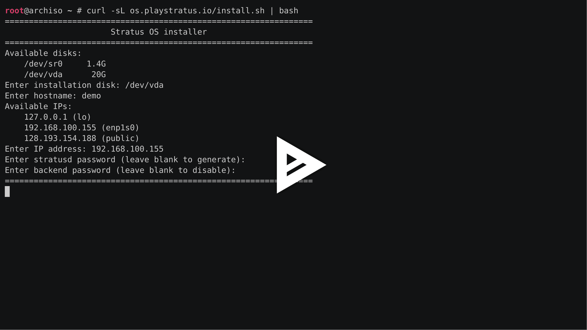

Stratus OS is the operating system that runs on each Stratus streaming server.
It was created in order to streamline the process of provisioning and
configuring new servers, and consists of an Arch Linux installation script and
several custom Arch packages. This approach to server deployment gives Stratus
the convenience of staying fully within the Arch Linux ecosystem while providing
complete customizability at a low maintenance cost.

## Arch Packages

The Stratus software required by each streaming node is distributed as two Arch
packages: `stratus-launcher` for the Stratus game launcher script and `stratusd`
for the Stratus streaming daemon. Both are available through a custom pacman
repository hosted at [os.playstratus.io][stratus-repo]. The stratus-launcher
package is small and straight forward. It just installs the Stratus launcher to
`/usr/bin/stratus-launcher` and creates a `stratus-launcher-init` service that
ensures the game environment is automatically initialized before stratusd is
started. In contrast, the stratusd package has several parts. Besides installing
the stratusd executable to `/usr/bin/stratusd`, it also

- Initializes the stratusd configuration in `/etc/stratusd.conf`
- Creates a `stratusd` user account and adds it to the required groups
- Creates the `/var/lib/stratusd/games` directory for storing games in
- Inserts a udev rule to allow virtual device creation by non-root users
- Installs the `stratusd` and `stratusd-sway` services

[stratus-repo]: https://os.playstratus.io

These last two systemd services have been carefully designed in order to support
running graphical games on an unattended headless system. First, they run as
user services instead of system services, meaning that they are launched by
systemd under a user session. This is necessary so that systemd initializes a
[D-Bus][dbus] message bus session, which most graphical apps depend on.
[Lingering][linger] must also be enabled for the `stratusd` user so that the
services can be started even when the user isn't logged in. The `stratusd-sway`
service starts a headless instance of the [Sway][sway] Wayland compositor, and
is configured as a dependency of the `stratusd` service. Once Sway has been
started, the `stratusd` service starts the Stratus streaming daemon and sets the
`WAYLAND_DISPLAY` and `DISPLAY` environment variables appropriately so that it
can find Sway's Wayland and XWayland servers, respectively. With this
configuration in place, Stratus is able to run games with full support for their
usual rendering technologies despite not having an active user session or a
connected physical display.

[dbus]: https://www.freedesktop.org/wiki/Software/dbus/
[linger]: https://wiki.archlinux.org/title/Systemd/User#Automatic_start-up_of_systemd_user_instances
[sway]: https://swaywm.org/

In addition to the stratusd and stratus-launcher packages, Stratus OS would not
be complete without a patched `fastfetch` package that includes the Stratus
logo:

## Arch Installation Script

The Stratus OS installation script (available at
[os.playstratus.io/install.sh][stratus-os-install]) is used to install these
packages and apply additional system configurations. It is designed to be run
from within a live Arch Linux environment, and was inspired by [Michael Daffin's
personal Arch install script][mdaffin-install]. After prompting the user for
basic information (such as the hostname, user account password, and disk to install
on), it performs the steps of a standard Arch installation, including disk
partitioning, filesystem creation, package installation, and boot loader
configuration. If the user didn't specify a password, a secure three-word
passphrase is automatically generated using a wordlist. Next, the stratusd and
stratus-launcher packages are installed from the custom Stratus repository and
configured according to the user's responses to the installer prompts. Finally,
the installer also downloads the AppImages for a set of default games.

[stratus-os-install]: https://os.playstratus.io/install.sh
[mdaffin-install]: https://github.com/mdaffin/arch-pkgs/blob/master/installer/install-arch

After a reboot, the server will be ready to accept stream sessions without any
additional intervention. The entire installation takes under 5 minutes, and is
captured in the Asciinema recording below.

