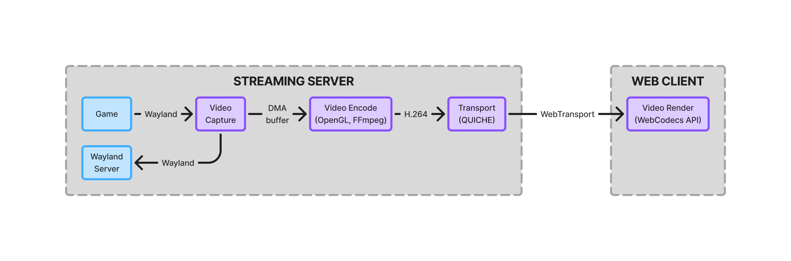
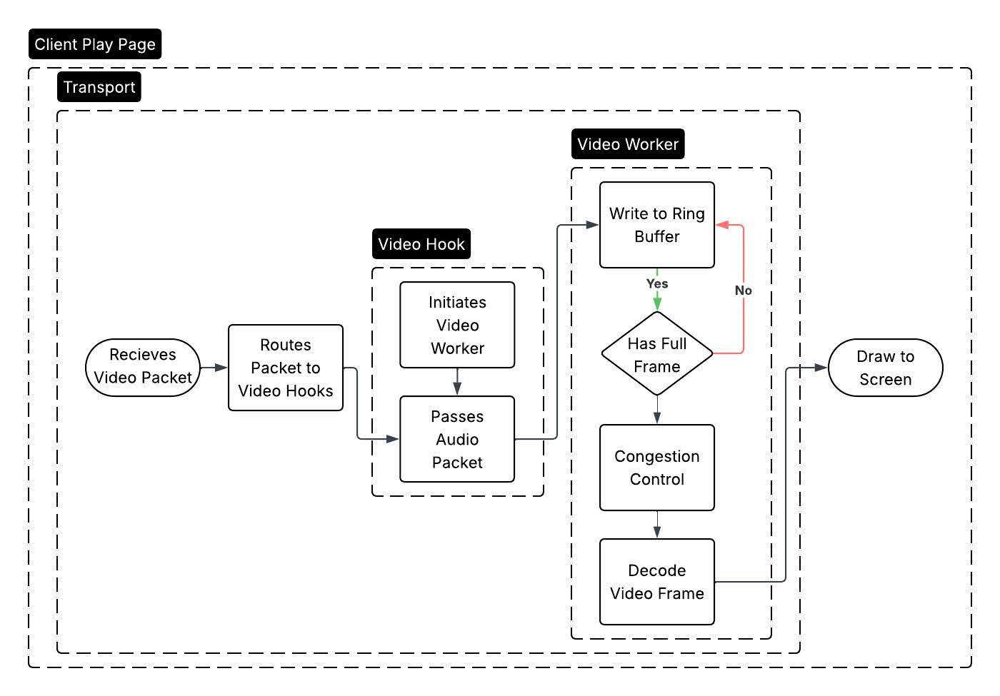

## Overview

The video streaming pipeline in Stratus is responsible for delivering video
frames from games to our client-side application running in the web browser.
It's broken down into four components: capture, encoding, transport, and
client-side rendering. On the streaming server, capture, encoding, and transport
each run in their own dedicated thread, using ring buffers for inter-thread
communication and synchronization.

At a high level, games send frame updates via the Wayland protocol, and they're
parsed by the Wayland proxy (explained in detail in the Wayland Proxy blog post)
to be packaged and enqueued into the capture/encode ring buffer. The encoding
module is in charge of reducing the size of video packets so that they can be
quickly streamed over the network. This thread spins in a loop, checking the
ring buffer and encoding the freshest frames into H.264 formatted packets.
Similarly, these packets are placed in the encode/transport ring buffer, and
dequeued by the transport thread to be sent to the web client.

## Encoding

We chose to implement the encoder thread using FFmpeg's `avcodec` library rather
than using a subprocess that uses FFmpeg's CLI. This choice gives us direct
programmatic control over the encoder's state. It also eliminates any overhead
related to process spawning and interprocess communication with pipes, which is
an important consideration in our latency-sensitive video pipeline.

### Codec and Pixel Format Selection

We encode games using H.264 (via `libx264`). H.264 was a straightforward choice
for a few reasons. It has universal support in various browsers via the
WebCodecs API, which gives us some flexibility for client-side decoding. H.264
also minimizes encoding latency compared to alternatives like AV1, which instead
offers better compression efficiency. Keeping encoding latency low is especially
important for us, since the Stratus hardware does not support hardware encoding.
As a result, encoding makes up a substantial portion of the end-to-end video
latency.

Games typically send their frame updates in a raw RGBA format which is not
compatible with H.264. The encoding thread converts new video frames to the
YUV420P format using `libswscale` before encoding them. We chose YUV420P over
YUV444P, sacrificing some color fidelity for a reduction in packet size. At
1080p, the perceptual difference in color is minimal, while the reduced packet
size results in lower latency for the transport thread.

### Parameter Tuning

The central tradeoff in our encoder configuration is encode time vs. quality vs.
encoded packet size. Software encoding is relatively slow, so encode time was
the most critical metric. That being said, decreasing encode time by creating
less compressed packets resulted in the transport thread becoming the
bottleneck. To manage this tension, we experimented with tuning `libx264`'s
presets, which balance encoding speed with compression ratio, and ultimately set
it to *ultrafast*. We also enabled the *zerolatency* tuning setting for
`libx264`, which similarly sacrifices compression efficiency for encoding speed.

To mitigate the effects of the increased packet size, we enabled differential
frames for our encoder by setting the *gop_size* to 30. This means that a full
frame (called a *keyframe*) is only sent once per 30 frames encoded, or every
half second when targeting a 60fps application; the remaining frames only
include information about data that has changed from the previous frame.
Depending on the visual complexity of the game output, this can significantly
decrease packet size. That being said, it introduces complexity in our handling
of dropped frames; if a differential frame is dropped, the client cannot
successfully recover until the next keyframe is received. Our strategy
addressing this issue is explained in detail in the Ring Buffer section.

Stratus targets 1080p game output to ensure good image quality across various
client display resolutions. To control the quality of encoded frames, we
primarily focused on tuning `libx264`'s constant rate factor (*crf*) parameter,
which controls the size of compressed packets vs. their quality. For our games,
we found a value of 23 provides nearly indistinguishable visual quality. One
capability we didn't end up using is adaptive encoder tuning, where encoder
parameters are dynamically adjusted based on client data. See our Future Work
post for a more in-depth analysis of this strategy and its effects.

## Ring Buffer Implementation

The streaming server uses two ring buffers to handle communication between each
thread, as well as synchronization to ensure that data is not overwritten while
it's being encoded or transmitted by the transport thread. Ring buffers are a
type of circular buffer which keeps track of a head and tail index into the
buffer; the *head* represents the index of the next entry that can be pushed
into the buffer, whereas the *tail* represents the index of the last entry that
was popped.

### Capture to Encode

The capture/encode ring buffer is the more complex of the two. The encoder
thread reads from it using a function called `rbuf_wait_peak_latest`, which
doesn't simply pop the tail element of the ring buffer; instead, it discards all
but the most recent entry, and returns that item without popping it. If the
buffer is empty, the encoder thread blocks until a frame arrives. The result is
that the encoder always works on the freshest available frame, and stale frames
captured while the encoder was busy are dropped.

It's important to peek at the frame rather than popping it so that the capture
thread doesn't overwrite a slot that the encoder is actively reading. When the
frame is finally popped, the ring buffer's tail is incremented, allowing that
index to be filled in with the next frame by the capture thread.

We also implement a backpressure mechanism so that the transport thread does not
become overwhelmed by encoded frames. Before encoding, the encoder thread checks
whether the encode/transport queue has space. If it doesn't, the frame is
skipped entirely. This is necessary because the transport layer must attempt to
deliver every encoded frame. Dropping a differential frame mid-stream would
leave the decoder in an inconsistent state until the next keyframe. It's safe to
simply drop the frame before encoding, where the cost is just losing a stale
frame, than to drop one after encoding, which could result in visual corruption
or jitter on the client.

Cleanup of captured frames is handled through a configurable `free` handler
attached to the ring buffer at initialization. When an item is popped, the ring
buffer just moves the tail pointer forward by one, with no cleanup. Then, when
the capture thread attempts to write into that slot again, it calls the free
handler on the existing contents before overwriting them. This was necessary
since there is Wayland-specific logic to be handled during cleanup that the
capture thread must be responsible for (releasing and destroying surfaces or
buffers), since it's the thread that has an open Wayland connection. It also
defers cleanup work from the encoder thread, which remains the bottleneck for
the pipeline, to the less-burdened capture thread.

### Encode to Transport

The encode/transport ring buffer is simpler. Because differential frames must be
delivered in order to avoid decoder corruption, the transport thread attempts to
send every frame present in the buffer rather than skipping ahead to the latest.
If a send fails, the error is logged for diagnosis, but the pipeline continues.
The transport layer already handles reliability at the QUIC level, so a failure
during transport points to some issue within the Quiche configuration, rather
than a network connectivity issue.

## Render

### Transport

The client render pipeline starts in the transport layer. This is where the
browser receives incoming video packets from the Stratus streaming server over
WebTransport. Transport is primarily responsible for reading the stream and
routing packets based on the stream's type. When it determines that a packet
belongs to the video stream, it forwards the data to the video hook rather than
attempting to decode or render it directly.

### Video Hook

The video hook connects the transport layer to the actual rendering system. It
owns the canvas on the client play page, creates the video worker, and transfers
the canvas to that worker using OffscreenCanvas. After the worker is
initialized, the hook forwards incoming video packets to it. So its role is
basically to set up the rendering environment and pass the video data to the
background thread.

### Video Worker

The video worker does most of the heavy lifting. First, it writes incoming
packet data into a ring buffer, because network chunks do not always arrive as
complete video frames. The worker checks whether the buffer contains a full
frame yet. If it does not, it keeps buffering more data.

Once a full frame is available, the worker runs congestion control. If the
client is falling behind, it drops stale delta frames until the next keyframe,
so playback stays close to real time. Then the worker decodes the frame using
WebCodecs and finally draws it to the on-screen canvas.
